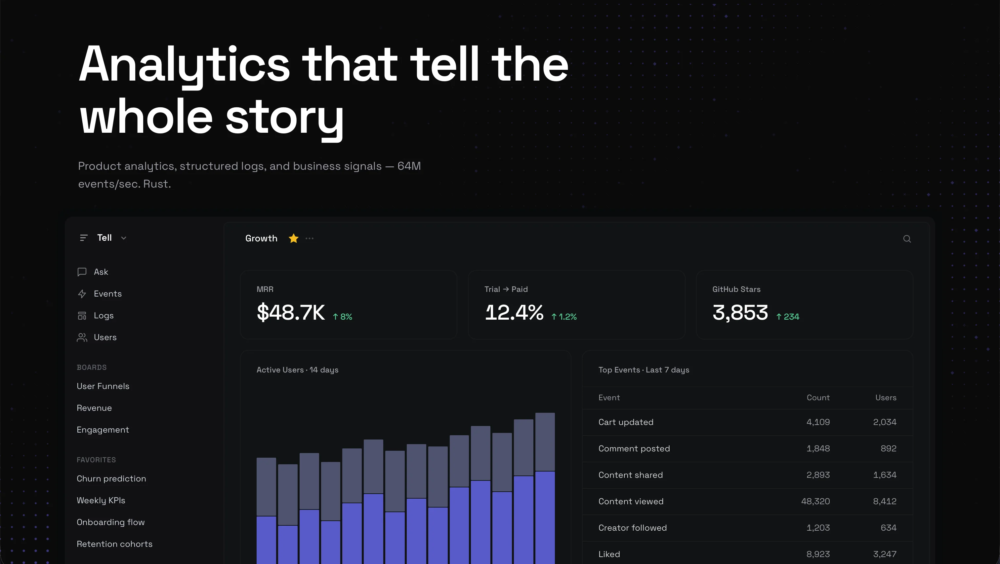

<p align="center">
  <strong>Analytics that tell the whole story.</strong><br>
  <sub>Events, metrics, logs, business data — one platform. The full picture.</sub>
</p>

<p align="center">
  
</p>

## Install

```bash
curl -sSfL https://tell.rs | bash
```

Single Rust binary. Memory-safe, no garbage collector. 64M events/sec. Self-host or use Tell Cloud.

## What Tell collects

- **Events** — User actions, page views, sessions, revenue. Custom properties. Identity resolution across devices.
- **Logs** — Structured logging with 9 severity levels. Anomaly detection. First-class, not bolted on.
- **Metrics** — Gauges, counters, histograms from agents and SDKs. Label-based breakdown.
- **Business data** — Pull revenue, ad spend, traffic, and operational data from tools you already use. 15 connectors via sandboxed WASM plugins.
- **Marks** — Releases, deploys, incidents. Every chart knows what changed.

## How data gets in

- **SDKs** — Rust (80ns/event), TypeScript, Go, Swift, Flutter, C++. Track events, identify users, structured logging.
- **Sources** — TCP (64M/s), Syslog, HTTP, File, Modbus.
- **Connectors** — Revenue (Stripe, Shopify), Marketing (Meta Ads, Klaviyo, Bitly), Development (GitHub), Infrastructure (Cloudflare), App Stores (Appbot, AppFigures, and more). Build your own with the plugin SDK.

## What you do with it

- **Analytics** — Funnels, retention cohorts, lifecycle, segments, audiences, group analytics, formulas, first-time math. Breakdowns by any field. Compare periods. Aggregations: sum, avg, min, max, median, p75–p99 — per event or per user.
- **Dashboards** — Boards with metric cards, charts, and markdown notes. Shareable via URL. Teams with roles.
- **AI** — Ask questions about your data in natural language. MCP server for AI assistants. Works with any OpenAI-compatible provider. LLM-generated dashboards.
- **ML** — Churn prediction, anomaly detection, auto segmentation, forecasting. Per-event enrichment. (experimental)
- **CLI** — Full product from the terminal. Interactive TUI, live streaming, SQL queries, natural language.
- **Privacy** — GDPR/CCPA compliant. No cookies. PII auto-redaction. All data anonymized.
- **Auth** — API keys, OAuth 2.0, RBAC, workspace isolation, audit logging.

## How data is processed

- **Routing** — Route logs to one place, events to another, metrics to archive — all from the same source. Content-aware rules. Fan-out to multiple destinations.
- **Transforms** — Pattern matching (8.1M events/sec), PII redaction (10.9M/sec), filtering, log clustering, automated IP banning.
- **Signals** — Real-time pub/sub on the pipeline. React to events as they happen. Build automated responses.
- **Storage** — ClickHouse, Parquet, Arrow-IPC, Vortex, Disk, Forwarder (Tell-to-Tell), Stdout.

## Compared To

| | Tell | PostHog | Mixpanel | Vector |
|--|:----:|:-------:|:--------:|:------:|
| Events + funnels | **✓** | ✓ | ✓ | — |
| Logs | **✓** | ✓ | — | ✓ |
| Metrics | **✓** | — | — | — |
| Business connectors | **✓** | — | — | — |
| Dashboards | **✓** | ✓ | ✓ | — |
| SDKs | **✓** | ✓ | ✓ | — |
| AI + MCP | **✓** | ✓ | ✓ | — |
| Real-time signals | **✓** | — | — | — |
| Data pipeline | **✓** | — | — | ✓ |
| Routing + transforms | **✓** | — | — | ✓ |
| Storage backends | Multiple | ClickHouse | — | ✓ |
| Self-host | **✓** | Docker | — | ✓ |
| Throughput | **64M/s** | ~100K/s | — | 86 MiB/s |
| Language | **Rust** | Python | Go | Rust |

## Performance

Apple M4 Pro · 12 cores · 5 clients · batch 500

### Ingest throughput (events/sec)

| Source | b500 | b100 | b10 | b3 |
|--------|------|------|------|------|
| TCP Binary | **64M** | 55M | 6.9M | 1.4M |
| HTTP FBS | 24M | 8.3M | 1.0M | 321K |
| HTTP JSON | 2.1M | 2.3M | 848K | 307K |
| Syslog TCP | 8.7M | 8.5M | 8.3M | 2.0M |

### Sink write throughput (10M events, realistic cardinality, unique payloads)

| Sink | Events/s | Time | Written | Ratio |
|------|----------|------|---------|-------|
| disk_binary | **33.0M** | 303ms | 639 MB | 0.36x |
| disk_binary_lz4 | 21.6M | 462ms | 145 MB | 0.08x |
| disk_plaintext | 1.4M | 7.37s | 2.7 GB | 1.53x |
| disk_plaintext_lz4 | 1.1M | 9.22s | 896 MB | 0.51x |
| arrow_ipc | 2.9M | 3.49s | 1.7 GB | 0.98x |
| parquet_snappy | 2.2M | 4.58s | 249 MB | 0.14x |
| parquet_lz4 | 2.6M | 3.81s | 251 MB | 0.14x |
| parquet_zstd | 2.3M | 4.38s | 171 MB | **0.10x** |
| parquet_uncompressed | 2.6M | 3.91s | 769 MB | 0.43x |
| vortex | 1.7M | 5.94s | 1.8 GB | 0.99x |

Ratio = bytes on disk / 1.8 GB input.

---

## SDKs (all open source, MIT)

- [**tell-rs**](https://github.com/tell-rs/tell-rs) — Rust (80ns/event, 10M/s delivered)
- [**tell-js**](https://github.com/tell-rs/tell-js) — TypeScript
- [**tell-go**](https://github.com/tell-rs/tell-go) — Go
- [**tell-cpp**](https://github.com/tell-rs/tell-cpp) — C++
- [**tell-swift**](https://github.com/tell-rs/tell-swift) — Swift
- [**sdk-flutter**](https://github.com/tell-rs/sdk-flutter) — Flutter

## Agent & Tools

- [**witness**](https://github.com/tell-rs/witness) — Host agent for logs + system metrics. 1.2 MB binary (Vector: 46 MB). 76ns/log, 30ns/metric, 4 MB idle memory. MIT.
- [**signals-sdk**](https://github.com/tell-rs/signals-sdk) — SSE client for Tell's signal bus. Build reactive agents. MIT.
- [**signals-apps**](https://github.com/tell-rs/signals-apps) — Example apps on signals-sdk. Reference: ip-ban agent.

Built by the founder of Logpoint (European SIEM, acquired).

[Website](https://tell.rs) · [Docs](https://tell.rs/docs) · [Privacy](https://tell.rs/legal/privacy) · [Security](https://tell.rs/legal/security) · [Terms](https://tell.rs/legal/terms)
